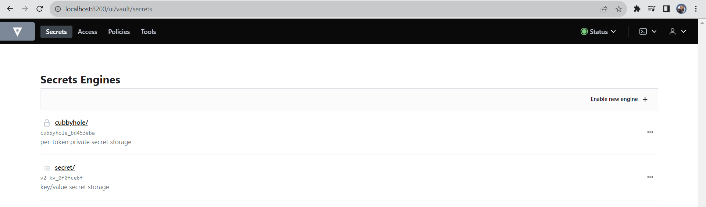
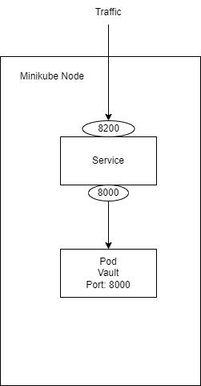

University: [ITMO University](https://itmo.ru/ru/)
Faculty: [FICT](https://fict.itmo.ru)
Course: [Introduction to distributed technologies](https://github.com/itmo-ict-faculty/introduction-to-distributed-technologies)
Year: 2023/2024
Group: K4113c
Author: Chaykov Artemiy Andreevich
Lab: Lab1
Date of create: 25.11.2023
Date of finished: TBD

Description
This is the first laboratory work in which you will test Docker, install Minikube, and deploy your first "pod."

Objectives
To get acquainted with Minikube and Docker tools, and deploy your first "pod."

Laboratory Work Results
As a result of this work, you should have:

A file with the manifest you developed to deploy a "pod" with the .yaml extension.

A diagram of the organization of containers and services drawn by you in draw.io or Visio.

Answers to questions (if possible), screenshots with the results of the work.

*Implementing*  
Manifest for vault in file hashicorpvault.yaml  
commands to reproduce:  
minikube kubectl -- apply -f hashicorpvault.yaml  
minikube kubectl -- expose pod vault --type=NodePort --port=8200    
  
To find Token for logs  
minikube kubectl -- logs vault  
Need to find line:  
Root Token:  ...  
  
Now we can port-forward Service and access vault with our token  
minikube kubectl -- port-forward service/vault 8200:8200  

What we did?  
We created pod with image of vault and internal port of 8000. Then we created Service with type NodePort. A NodePort service makes the service accessible on a static port on each node in the cluster. It opens a specific port (in this case, 8200) on all nodes, and any traffic sent to this port is forwarded to the service.  

