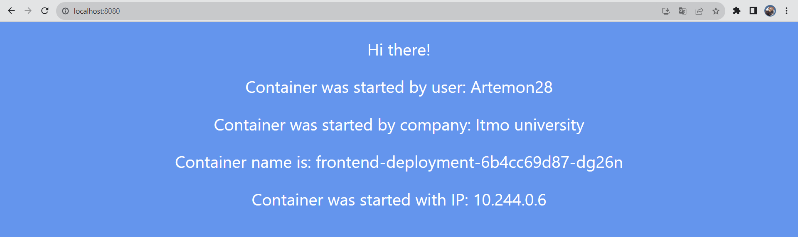
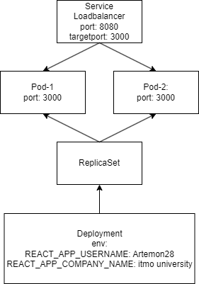

University: [ITMO University](https://itmo.ru/ru/)
Faculty: [FICT](https://fict.itmo.ru)
Course: [Introduction to distributed technologies](https://github.com/itmo-ict-faculty/introduction-to-distributed-technologies)
Year: 2023/2024
Group: K4113c
Author: Chaykov Artemiy Andreevich
Lab: Lab2
Date of create: 25.11.2023
Date of finished: TBD  
  
Description  
In this laboratory work, you will become familiar with deploying a full-fledged web service with multiple replicas.

Objectives  
To learn about the types of container deployment "controllers," become acquainted with network services, and deploy your own web application.  
  
*Implementation*
Fun fact, pods run on port 3000 and it doesn't depends on Deployment. To find out it need to read logs.  
  
I used type LoadBalancer for Service, as It should be logical for frontend to balance people requests.  
  

  
Obviously vars REACT_APP_USERNAME, REACT_APP_COMPANY_NAME will not change, because I specified it in Deployment for every pod.  
However, pod doesn't change when I access it seversl times. I assume the reason is that pods are not busy after the request and I can't load them from web browser. That's why loadbalancer chose first one each time.  
Or my another assumption: Minikube typically emulates the load balancer behavior by exposing the service on a NodePort and configuring an external IP to access the service. This behavior may lead to a situation where external traffic is primarily reaching out of the nodes.  

You can find scheme for this lab below:  

