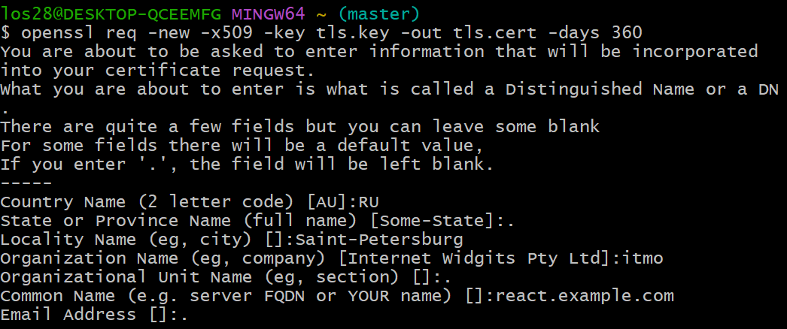
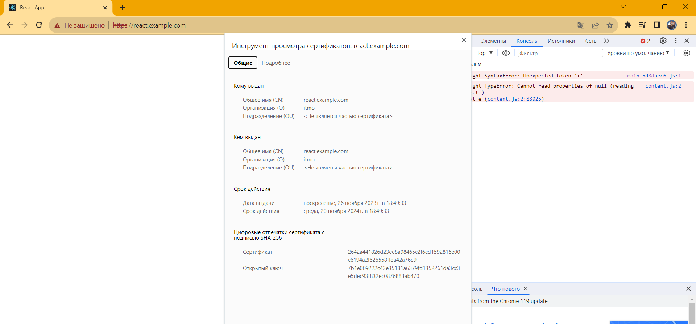
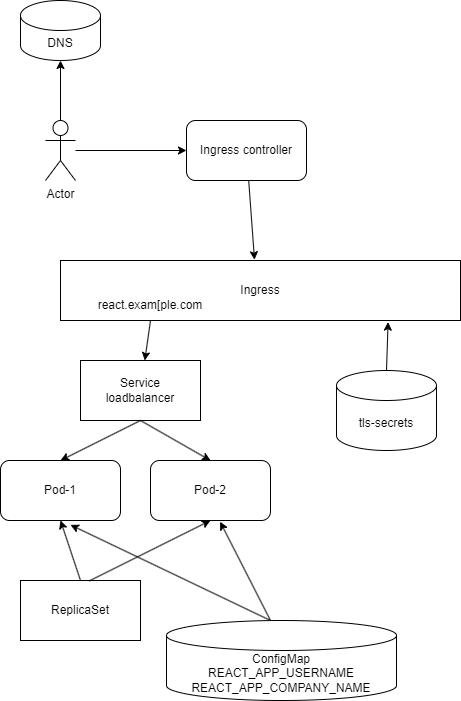

University: [ITMO University](https://itmo.ru/ru/)
Faculty: [FICT](https://fict.itmo.ru)
Course: [Introduction to distributed technologies](https://github.com/itmo-ict-faculty/introduction-to-distributed-technologies)
Year: 2023/2024
Group: K4113c
Author: Chaykov Artemiy Andreevich
Lab: Lab3
Date of create: 26.11.2023
Date of finished: TBD  
  
Description  
In this laboratory work, you will become familiar with certificates and secrets in Minikube, as well as the rules for secure data storage in Minikube.  
  
Objectives  
To get acquainted with certificates and secrets in Minikube and learn the rules for secure data storage in Minikube.  
  
**Implementation**  
  
1. Create certificate  
open git bash  
openssl genrsa -out tls.key 2048  
openssl req -new -x509 -key tls.key -out tls.cert -days 360  
Insert metedata  
  
  
2. Install it to minikube or create secrets  
kubectl create secret tls tls-secret --cert=tls.cert --key=tls.key  

3. Create Configmap [envvarCM](envvarCM.yaml), [replicaSet](frontendreplicaset.yaml), [LoadBalancer](frontendservice.yaml) and [ingress](tlsingress.yaml)  
  
4. Edit hosts file in windows in dir C:\Windows\System32\drivers\etc with new line 127.0.0.1 react.example.com  

5. minikube tunnel

Now we can see empty page wih onlu icon and header  
  
  
Ivan Filianin assume that the problem could be with CORS (Cross-Origin Resource Sharing) that mean that frontend app is not configured to allow different domains 😬  
  
Final Scheme:
