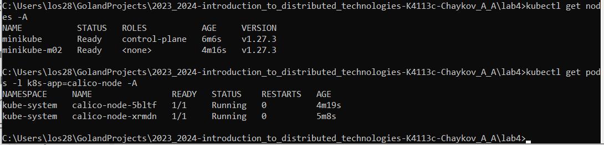
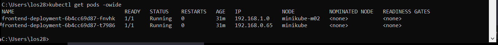
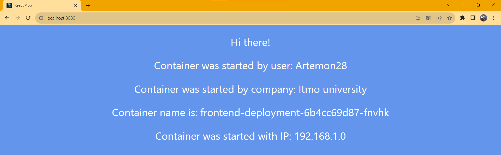
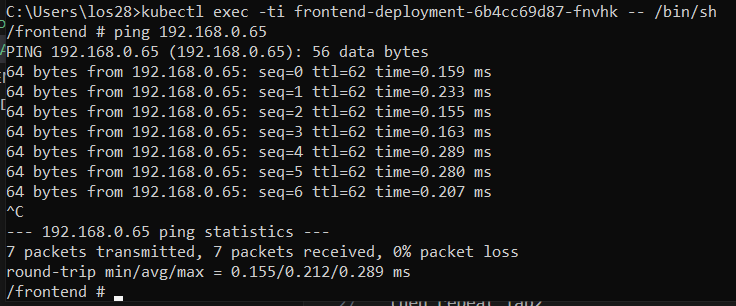
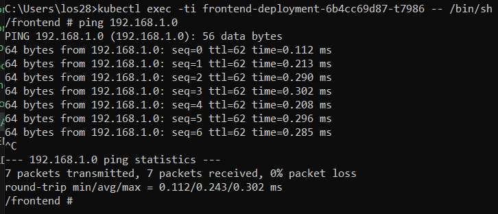
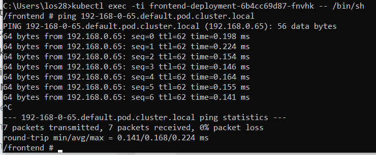
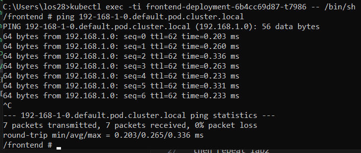
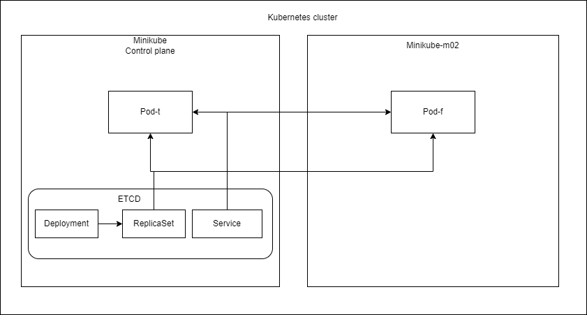

University: [ITMO University](https://itmo.ru/ru/)
Faculty: [FICT](https://fict.itmo.ru)
Course: [Introduction to distributed technologies](https://github.com/itmo-ict-faculty/introduction-to-distributed-technologies)
Year: 2023/2024
Group: K4113c
Author: Chaykov Artemiy Andreevich
Lab: Lab4
Date of create: 26.11.2023
Date of finished: TBD  
  
Description
This is the last laboratory work in which you will become familiar with communication networks in Minikube. Kubernetes has the peculiarity of simultaneously using underlay and overlay networks, and management can be organized by various CNIs.  
  
Objectives
To get acquainted with CNI Calico and the IPAM Plugin feature, as well as to study the features of CNI and CoreDNS.  
  
**Implementation**  
  
The best way to install and run calico on minikube is through operator way    
To add new node - minikube node add  
  
  
kubectl delete ippools default-ipv4-ippool  
kubectl label nodes minikube zone=west  
kubectl label nodes minikube-m02 zone=east  
kubectl apply -f ippools.yaml  
then repeat lab2  
  
Here we can see that our pods are located on two different nodes  

  
port forward Service and...  

In result I have again only one container name and address IP  
Why?  
As I understood LoadBalancer doesn't balance load, it's more like a name for your service. So it rely on deployment that choose first pod  
  
I have IPs: 192.168.0.65 (t...) and 192.168.1.0 (f...), let's ping them  
 
 
 
 
  
Scheme of the cluster is here:  
